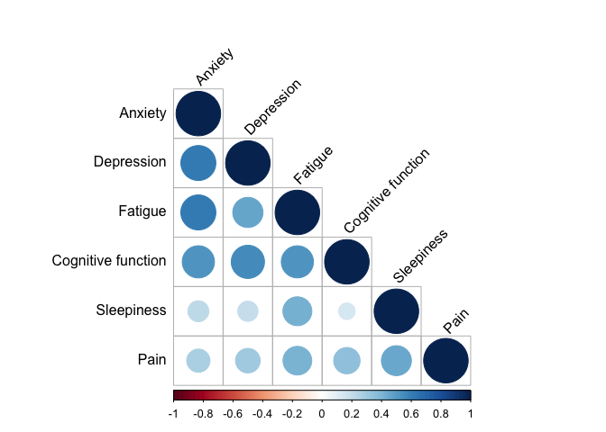
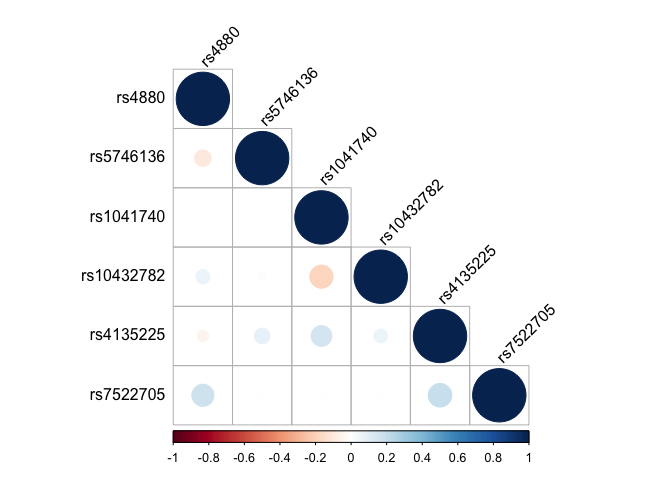

mvNUR Workflow 0: Data preparation
================
Lacey W. Heinsberg


# Copyright

Copyright 2023, University of Pittsburgh. All Rights Reserved.  
License: CC BY-SA 3.0
([link](https://creativecommons.org/licenses/by-sa/3.0/))

# Overview

A fully synthetic example data set has been created to accompany this
repository so that we can freely and safely share it without restriction
on GitHub in order to document the analytical steps and interpretation
related to our two exemplar multivariate Bayesian approaches. The real
data from which the synthetic data were generated were collected via a
nurse-led study from the University of Pittsburgh focused on individuals
with breast cancer. The study collected extensive data related to
symptoms, and a sub-study collected candidate gene single nucleotide
polymorphism (SNP) data. Candidate symptoms selected for inclusion in
this tutorial included anxiety, depression, fatigue, daytime sleepiness,
cognitive function, and pain. Candidate SNPs selected for examination in
this study included rs4880, rs5746136, rs1041740, rs10432782, rs4135225,
and rs7522705. The original data set consisted of 110 participants. For
the purposes of our examples, a larger, synthetic data set mirroring the
statistical properties of the original data set was created. The data
set contains 770 participants.

# Load libraries

Load the libraries needed to run the code.

``` r
library(tidyverse) ## Data wrangling 
library(pander) ## Table formatting 
library(preprocessCore) ## Preprocessing functions
#if (!require("BiocManager", quietly = TRUE))
#    install.packages("BiocManager") ## Facilitate installation of preprocessCore
#BiocManager::install("preprocessCore") 
# Note: `preprocessCore` isn't available for R version 4.3.1, but can be installed using `biocManager` https://bioconductor.org/packages/release/bioc/html/preprocessCore.html
library(corrplot) ## Visualize correlation matrix
```

# Prepare data for multiariate analyses

The programs we will use for multivariate analyses (bnlearn and
mvBIMBAM) require the data to be in a specific format for analysis. In
this markdown, we are preparing and formatting the data for analysis.

## Read in the synthetic data set

Please see the README.md for information regarding the example synthetic
data set.

``` r
# Read in the synthetic data set created for use with this example analysis code
df_synth <- read.csv("data/BrCa_synthetic.csv")
head(df_synth)
```

    ##     ID EMO_tscore bdito FAT_tscore paohcif EPSscore pain age education race
    ## 1 1000       47.8     8       46.9       0        5    0  60        18    0
    ## 2 1001       47.8     8       49.2       4       12    3  51        21    0
    ## 3 1002       49.4    18       50.4      16       12    1  57        20    0
    ## 4 1003       45.9     3       38.5       6        2    0  51        16    0
    ## 5 1004       50.8     6       46.9       0        7    1  63        16    0
    ## 6 1005       37.1     0       38.5       0        2    1  59        15    0
    ##   rs4880 rs5746136 rs1041740 rs10432782 rs4135225 rs7522705
    ## 1      1         0         1          1         1         1
    ## 2      2         1         0          1         0         2
    ## 3      2         1         0          0         0         0
    ## 4      1         1         0          0         1         1
    ## 5      0         1         1          0         1         0
    ## 6      1         0         0          0         1         1

``` r
n <- dim(df_synth)[1]

# Define the phenotypes (in this case, symptoms) of interest
traits <- c("EMO_tscore", "bdito", "FAT_tscore", "paohcif", "EPSscore", "pain")

# Define variants of interest 
genes <- c("rs4880", "rs5746136", "rs1041740", "rs10432782", "rs4135225", "rs7522705")
```

In brief, the data set focuses on 6 symptoms (EMO_tscore, bdito,
FAT_tscore, paohcif, EPSscore, pain) and 6 candidate variants of
interest (rs4880, rs5746136, rs1041740, rs10432782, rs4135225,
rs7522705) and contains 770 participants.

``` r
# Read in a mapping of variable name to informative label
dict <- read.csv("data/BrCa_synthetic_SimpleDict.csv")
pander(dict, "Data dictionary") 
```

|  Variable  |       Label        |                                                                                                                                                                                                                                        Description                                                                                                                                                                                                                                         |
|:----------:|:------------------:|:------------------------------------------------------------------------------------------------------------------------------------------------------------------------------------------------------------------------------------------------------------------------------------------------------------------------------------------------------------------------------------------------------------------------------------------------------------------------------------------:|
| Emo_tscore |      Anxiety       | PROMIS Emotional Distress Anxiety (Short Form 8a) - 8 items measuring emotional distress and anxiety (panic, fearfulness, worry, dread, tension, nervousness, restlessness, and somatic symptoms including racing heart and dizziness) in the last 7 days. This instrument generates T-scores, which are standard scores with a mean of 50 and standard deviation of 10 in the U.S. general population. Higher T-scores indicate worse distress and anxiety. T-scores range from 10 to 90. |
|   bdito    |     Depression     | PROMIS Emotional Distress Anxiety (Short Form 8a) - 8 items measuring emotional distress and anxiety (panic, fearfulness, worry, dread, tension,nervousness, restlessness, and somatic symptoms including racing heart and dizziness) in the last 7 days. This instrument generates T-scores, which are standard scores with a mean of 50 and standard deviation of 10 in the U.S. general population. Higher T-scores indicate worse distress and anxiety. T-scores range from 10 to 90.  |
| FAT_tscore |      Fatigue       |                                                         PROMIS Fatigue (Short Form 8a) - 8 items measuring the experience of fatigue and the interference of fatigue on daily activities over the past 7 days. This instrument generates T-scores, which are standard scores with a mean of 50 and standard deviation of 10 in the U.S. general population. Higher T-scores indicate worse fatigue. T-scores range from 10 to 90.                                                          |
|  paohcif   | Cognitive function |                    Patient Assessment of Own Functioning Inventory (PAOFI) - 31 items measuring self-reported ‘recent’ function consisting of 5 dimensions: memory, language and communication, use of hands, sensory-perceptual, higher level cognitive and intellectual functioning. Higher scores indicate worse perceived functioning. Scores range from 0 to 155. For this study, we pulled the cognitive function dimension for which scores range from 0 to 45.                     |
|  EPSscore  |     Sleepiness     |                                                                                                                                                         Epworth Sleepiness Scale - 8 item scale measuring self-reported ‘recent’ daytime sleepiness. Higher score indicate greater daytime sleepiness. Scores range from 0 to 24.                                                                                                                                                          |
|    pain    |        Pain        |                                                 Brief Pain Inventory (Short Form) - a widely used clinical tool for assessing pain (worst pain in the last 24 hours \[0-10\], least pain in the last 24 hours \[0-10\], pain on average \[0-10\], paing at the time of the interview \[0-10\], pain relief from treatment(s) in the last 24 hours \[0%-100%\]). Higher scores indicate higher levels of pain, each item ranges from 0-10.                                                  |
|   rs4880   |     Variant 1      |                                                                                                                                                                                                                          SOD2 gene, hg19 position chr6: 160113872                                                                                                                                                                                                                          |
| rs5746136  |     Variant 2      |                                                                                                                                                                                                                          SOD2 gene, hg19 position chr6: 160103084                                                                                                                                                                                                                          |
| rs1041740  |     Variant 3      |                                                                                                                                                                                                                          SOD1 gene, hg19 position chr21: 33040162                                                                                                                                                                                                                          |
| rs10432782 |     Variant 4      |                                                                                                                                                                                                                          SOD1 gene, hg19 position chr21: 33036391                                                                                                                                                                                                                          |
| rs4135225  |     Variant 5      |                                                                                                                                                                                                                          TXN gene, hg19 position chr9: 113006691                                                                                                                                                                                                                           |
| rs7522705  |     Variant 6      |                                                                                                                                                                                                                          PRDX1 gene, hg19 position chr1: 45992300                                                                                                                                                                                                                          |
|    race    |        Race        |                                                                                                                                                                                                                           Self-identified race, 0=White, 1=Black                                                                                                                                                                                                                           |
|    age     |        Age         |                                                                                                                                                                                                                                        Age in years                                                                                                                                                                                                                                        |
| education  |     Education      |                                                                                                                                                                                                                              Self-reported years of education                                                                                                                                                                                                                              |

Data dictionary (continued below)

|          Type          |                                                                                                     Citation                                                                                                      |
|:----------------------:|:-----------------------------------------------------------------------------------------------------------------------------------------------------------------------------------------------------------------:|
|        Numeric         | Pilkonis, P.A. et al. (2011) Item banks for measureing emotional distress from the patient-reported outcomes measurement information system (PROMIS): Depression, Anxiety, and Anger, Assesssment, 18(3), 263-283 |
|        Numeric         |                                                         Beck, A.T. et al. (1996) Beck Depression Inventory-II. San Antonio: The Psychological Corporation                                                         |
|        Numeric         |                              Cell, D. et al. (2016) PROMIS fatigue item bank had clinical validity across diverse chronic conditions. Journal of Clinical Epidemiology, 73, 128-134                               |
|        Numeric         |                                                 Chelune, G. J. et al. (1986) Neuropsychological and personality correlates of patients’ complaints of disability.                                                 |
|        Numeric         |                                   Cleeland, C.S. et al. (1994). Pain assessment: Global use of the Brief Pain Inventory. Annals, Academy of Medicine, Sigapore, 23(2), 129-138                                    |
|        Numeric         |                                                                         Cleeland, C.S. et al. (2009). The Brief Pain Inventory User Guide                                                                         |
|        Numeric         |                                                                                                                                                                                                                   |
|        Numeric         |                                                                                                                                                                                                                   |
|        Numeric         |                                                                                                                                                                                                                   |
|        Numeric         |                                                                                                                                                                                                                   |
|        Numeric         |                                                                                                                                                                                                                   |
|        Numeric         |                                                                                                                                                                                                                   |
| Numeric, encoded value |                                                                                                                                                                                                                   |
|        Numeric         |                                                                                                                                                                                                                   |
|        Numeric         |                                                                                                                                                                                                                   |

Examine correlation structure of the symptoms.

``` r
# Subset the dataset to include only the selected traits
subset_df <- df_synth[traits]
# Calculate the correlation matrix
cor_matrix <- cor(subset_df, use = "complete.obs")
# Define custom labels for rows and columns
custom_labels <- c(
  "EMO_tscore" = "Anxiety",
  "bdito" = "Depression",
  "FAT_tscore" = "Fatigue",
  "paohcif" = "Cognitive function",
  "EPSscore" = "Sleepiness",
  "pain" = "Pain"
)
# Update row and column names using custom labels
rownames(cor_matrix) <- custom_labels[rownames(cor_matrix)]
colnames(cor_matrix) <- custom_labels[colnames(cor_matrix)]
# Create a correlation plot
corrplot(cor_matrix, method = "circle", type = "lower", tl.col = "black", tl.srt = 45)
```

<!-- -->

Examine correlation structure of SNPs.

``` r
# Subset the dataset to include only the selected traits
subset_df <- df_synth[genes]
# Calculate the correlation matrix
cor_matrix <- cor(subset_df, use = "complete.obs")
# Create a correlation plot
corrplot(cor_matrix, method = "circle", type = "lower", tl.col = "black", tl.srt = 45)
```

<!-- -->

Summarize missing data

``` r
missing_data_table <- df_synth %>%
  summarise(across(everything(), ~sum(is.na(.)))) %>% # Count NA values in each column
  gather(key = "Column", value = "Number_of_NAs") %>% # Convert to long format
  arrange(desc(Number_of_NAs)) # Sort by the number of NAs
pander(missing_data_table)
```

|   Column   | Number_of_NAs |
|:----------:|:-------------:|
| EMO_tscore |       7       |
|     ID     |       0       |
|   bdito    |       0       |
| FAT_tscore |       0       |
|  paohcif   |       0       |
|  EPSscore  |       0       |
|    pain    |       0       |
|    age     |       0       |
| education  |       0       |
|    race    |       0       |
|   rs4880   |       0       |
| rs5746136  |       0       |
| rs1041740  |       0       |
| rs10432782 |       0       |
| rs4135225  |       0       |
| rs7522705  |       0       |

## Clean up data

First, let’s prepare our data sets. Currently, the software we are using
does not allow missing data for multivariate phenotype analysis, so
select complete cases only. We will also set up a few data frames in
preparation to regress out variation related to our covariates of
interest (in this example, age and race).

1)  `df_i1_regress`: contains all variables of interest ordered and
    filtered for complete cases  
2)  `df_i1`: contains all variables except the covariates that will be
    regressed out below (in this example, age and race)  
3)  `df_synth`: Recode 0, 1, 2 genotypes to AA, AB, BB for later use in
    mvBIMBAM

``` r
# The first data frame (df_i1_regress) contains all variables of interest ordered 
# and filtered for complete cases
df_i1_regress <- df_synth %>% 
  select(all_of(genes), 
         all_of(traits),
         race, 
         age) %>%
  filter(complete.cases(.))
n <- dim(df_i1_regress)

# The second data frame (df_i1) contains all variables except the covariates that
# will be regressed out (in this example, age and race)
df_i1 <- df_synth %>% 
  select(all_of(genes), all_of(traits)) %>% 
  filter(complete.cases(.))

# Recode 0, 1, 2 genotypes to AA, AB, BB for later use in mvBIMBAM 
df_synth <- df_synth %>% 
  mutate_at(
    .vars = vars(starts_with("rs")),
    .funs = list(~ case_when(
      . == 2 ~ "BB",
      . == 1 ~ "AB",
      . == 0 ~ "AA"
    ))
  )

# Create Genotype (G) and Phenotype (Y) matrices
G <- as.matrix(df_i1 %>% select(all_of(genes)))
head(G)
```

    ##      rs4880 rs5746136 rs1041740 rs10432782 rs4135225 rs7522705
    ## [1,]      1         0         1          1         1         1
    ## [2,]      2         1         0          1         0         2
    ## [3,]      2         1         0          0         0         0
    ## [4,]      1         1         0          0         1         1
    ## [5,]      0         1         1          0         1         0
    ## [6,]      1         0         0          0         1         1

``` r
Y <- as.matrix(df_i1 %>% select(all_of(traits)))
head(Y)
```

    ##      EMO_tscore bdito FAT_tscore paohcif EPSscore pain
    ## [1,]       47.8     8       46.9       0        5    0
    ## [2,]       47.8     8       49.2       4       12    3
    ## [3,]       49.4    18       50.4      16       12    1
    ## [4,]       45.9     3       38.5       6        2    0
    ## [5,]       50.8     6       46.9       0        7    1
    ## [6,]       37.1     0       38.5       0        2    1

There are 763, 14 participants with complete data that we will retain
for our analyses.

## Normalize and adjust data for covariates

In this example, we are adjusting our phenotypes of interest for the
covariates age and race using ordinary linear regression models. If
adapting this code for your own work, manually edit the covariate names
in the `f_quatile_norm_resid()` function. Note that the sensitivity of
the Bayesian multivariate mvBIMBAM framework to outlier values and
non-normality also necessitates the normalization of phenotypes. As
shown below, residualized phenotypes (i.e., adjusted for age/race) are
order quantile-normalized.

### Create adjustment/normalization functions

``` r
# Create a function to perform residual adjustment for covariates (in this example,
# we are adjusting for age and race)
f_quantile_norm_resid <- function(Y, df) {
  {o <- apply(Y, 2, function(x) resid(lm(x ~ age + race, data = df)))} # If adapting this code for your own work, edit this line to adjust for covariates of interest, replacing age and race with your covariate variable names 
  return(o)
}

# Create function to 'super quantile normalize' the data 
f_quantile_normalize_adjust <- function(Y, data, ...) {
  # Quantile normalize
  Y_qn <- normalize.quantiles(Y)
  # Fit Y ~ Age + Race, extra residual (using function created above)
  Y_qn_resid <- f_quantile_norm_resid(Y = Y_qn, df = data, ...) 
  # Quantile normalize the residual
  Y_qn_resid_qn <- data.frame(normalize.quantiles(Y_qn_resid))
  return(Y_qn_resid_qn)
}
```

### Apply functions to perform normalization and covariate adjustment

``` r
# Create a quantile normalized adjusted Y data frame (i.e., quantile normalization 
# and covariate adjustment is performed in one fell swoop)
qn_resid_Y <- f_quantile_normalize_adjust(Y, data = df_i1_regress)
# Create a copy of this data frame for use later in this workflow 
qn_resid_Y_b <- qn_resid_Y 
# Rename the columns of the quantile normalized data frame to match the 
# phenotypes of interest  
names(qn_resid_Y) <- traits
head(qn_resid_Y)
```

    ##   EMO_tscore       bdito FAT_tscore   paohcif  EPSscore      pain
    ## 1 -0.8851885  2.30362054  -3.330215 -5.645429 -3.414409 -6.012957
    ## 2 -1.9542886  0.09188708  -3.221254 -1.577718  7.196097  1.066255
    ## 3 -0.1561693  9.13047401  -2.133030 13.281734  8.530244 -3.592499
    ## 4 -3.4144091 -6.10527417  -7.413173  1.066255 -8.598853 -7.199561
    ## 5  1.8913640  0.83681075  -2.840231 -4.802835  1.891364 -1.847911
    ## 6 -6.1052742 -8.14287258  -6.446351 -6.057697 -8.142873 -2.818185

Note: For one test user (DM), the above chunk threw the error:

    Error in normalize.quantiles(Y) : 
    ERROR; return code from pthread_create() is 22

This issue was resolved by updating Rstudio to the latest version.

## Remove outliers

Observations in violation of multivariate normality at an alpha=0.01
level based on Mahalanobis distance-based test statistics are now
removed to avoid spurious conclusions.

### Write a function to calculate Mahalanobis distance

``` r
# Create a function to calculate Mahalanobis distance
getMD <- function(x) {
  Sx <- cov(x)
  m <- mahalanobis(x, colMeans(x), Sx)
  return(m)
}
```

### Apply function to identify outliers

``` r
# Drop individuals with data violating multivariate normality at alpha = 0.01
i_keep <- which(pchisq(getMD(qn_resid_Y_b), df = dim(Y)[2]) > 0.01)
```

## Create a summary

``` r
# Record sample sizes in a summary table
table1 <- data.frame(study=rep(NA,1),N.traits=NA,N.variants=NA,N.total=NA,n.complete=NA,n.used=NA)
i <- 1
table1[i,"study"] <- "Synthetic Cohort - Traits"
table1[i,"N.total"] <- nrow(df_synth)
table1[i,"n.complete"] <- nrow(qn_resid_Y)
table1[i,"n.used"]  <- nrow(qn_resid_Y[i_keep, ])
table1[i,"N.traits"] <- ncol(qn_resid_Y)
table1[i,"N.variants"] <- length(genes)
table1[i,]
```

    ##                       study N.traits N.variants N.total n.complete n.used
    ## 1 Synthetic Cohort - Traits        6          6     770        763    763

``` r
# Print number of observations due to violation of multivariate normality 
cat(dim(Y)[1] - length(i_keep), " Obs removed due to violation of MV-Normality")
```

    ## 0  Obs removed due to violation of MV-Normality

``` r
# Add to summary table
table1$n.removed <- table1$N.total - table1$n.used
table1$percent.removed <- round(100*table1$n.removed/table1$N.total,2)
```

``` r
pander(table1,caption="Sample sizes")
```

|           study           | N.traits | N.variants | N.total | n.complete |
|:-------------------------:|:--------:|:----------:|:-------:|:----------:|
| Synthetic Cohort - Traits |    6     |     6      |   770   |    763     |

Sample sizes (continued below)

| n.used | n.removed | percent.removed |
|:------:|:---------:|:---------------:|
|  763   |     7     |      0.91       |

## Prepare and save final files

### mvBIMBAM

``` r
# Write phenotypes to a text file for use in mvBIMBAM 
if (!dir.exists("./inputs")) {
  dir.create("./inputs")
}
write.table(round(qn_resid_Y[i_keep,], 8), 
            "./inputs/synthetic_pheno_bimbam.txt", sep = " ", 
            row.names = F, col.names = F)

# Refine genotype data for mvBIMBAM and write file
Geno_write <- df_synth %>% select(all_of(genes), all_of(traits)) %>%
  filter(complete.cases(.)) %>%
  select(all_of(genes)) %>%
  {.[i_keep,]} # Apply i_keep matrix here to retain non-outlying participants

# Grep rs column numbers to create the geno_string file required for mvBIMBAM format
rs_cols <- grep("^rs", colnames(df_synth), value = TRUE)

# Create geno_string format required for mvBIMBAM, filtering data set for only i_keep participants
Geno_String <- map(rs_cols, ~ {
  Geno_write <- df_synth %>%
    select(all_of(.x), all_of(traits)) %>%
    filter(complete.cases(.)) %>%
    select(all_of(.x))%>%
    {.[i_keep,]}
  
  # Creating the Geno_String for each SNP rsID  
  Geno_String <- paste0(unlist(c(Geno_write)), collapse = ",")
  Geno_String <- paste0(.x, ",", Geno_String)
  
  Geno_String
}) 

# Polish geno_string for mvBIMBAM
final_Geno_String <- paste0(unlist(Geno_String), collapse = "\n")
M <- length(unlist(strsplit(Geno_String[[1]], ","))) - 1
N <- length(Geno_String)
final_Geno_String <- paste0(M, "\n", N, "\n", final_Geno_String)

# Write it out 
writeLines(final_Geno_String, con = "./inputs/synthetic_geno_bimbam.txt", sep = "")
```

### bnlearn

``` r
# Check for data directory; if not present, create it 
if (!dir.exists("./data")) {
  dir.create("./data")
}

# Write data for bnlearn
saveRDS(data.frame(Geno_write, round(qn_resid_Y[i_keep,], 8)), file = "data/SyntheticQuantNorm.rds")
```

# Session information

``` r
sessionInfo()
```

    ## R version 4.2.1 (2022-06-23)
    ## Platform: aarch64-apple-darwin20 (64-bit)
    ## Running under: macOS Ventura 13.4
    ## 
    ## Matrix products: default
    ## BLAS:   /Library/Frameworks/R.framework/Versions/4.2-arm64/Resources/lib/libRblas.0.dylib
    ## LAPACK: /Library/Frameworks/R.framework/Versions/4.2-arm64/Resources/lib/libRlapack.dylib
    ## 
    ## locale:
    ## [1] en_US.UTF-8/en_US.UTF-8/en_US.UTF-8/C/en_US.UTF-8/en_US.UTF-8
    ## 
    ## attached base packages:
    ## [1] stats     graphics  grDevices utils     datasets  methods   base     
    ## 
    ## other attached packages:
    ##  [1] corrplot_0.92         preprocessCore_1.60.2 pander_0.6.5         
    ##  [4] lubridate_1.9.2       forcats_1.0.0         stringr_1.5.0        
    ##  [7] dplyr_1.1.2           purrr_1.0.1           readr_2.1.4          
    ## [10] tidyr_1.3.0           tibble_3.2.1          ggplot2_3.4.2        
    ## [13] tidyverse_2.0.0       knitr_1.42           
    ## 
    ## loaded via a namespace (and not attached):
    ##  [1] Rcpp_1.0.10      highr_0.10       pillar_1.9.0     compiler_4.2.1  
    ##  [5] tools_4.2.1      digest_0.6.31    timechange_0.2.0 evaluate_0.20   
    ##  [9] lifecycle_1.0.3  gtable_0.3.3     pkgconfig_2.0.3  rlang_1.1.0     
    ## [13] cli_3.6.1        rstudioapi_0.14  yaml_2.3.7       xfun_0.38       
    ## [17] fastmap_1.1.1    withr_2.5.0      generics_0.1.3   vctrs_0.6.1     
    ## [21] hms_1.1.3        grid_4.2.1       tidyselect_1.2.0 glue_1.6.2      
    ## [25] R6_2.5.1         fansi_1.0.4      rmarkdown_2.21   tzdb_0.3.0      
    ## [29] magrittr_2.0.3   scales_1.2.1     htmltools_0.5.5  colorspace_2.1-0
    ## [33] utf8_1.2.3       stringi_1.7.12   munsell_0.5.0
