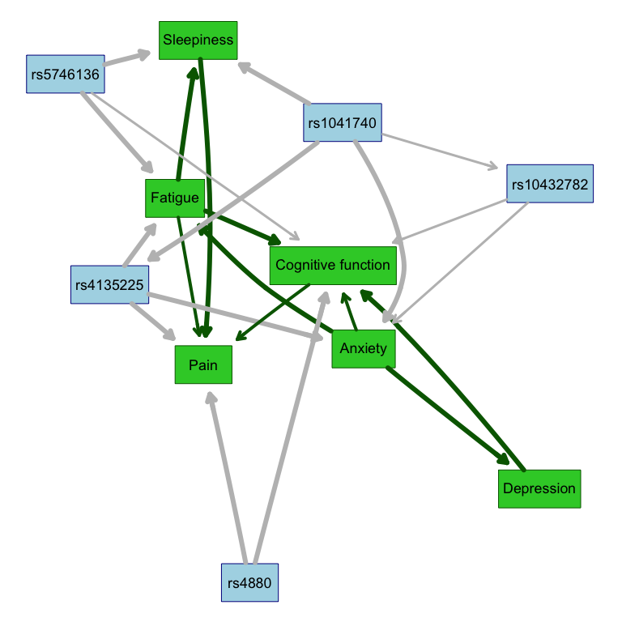
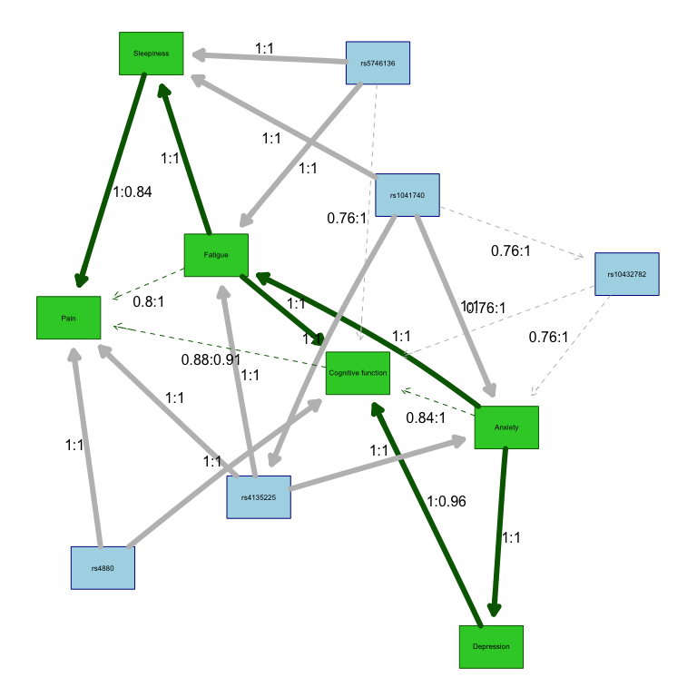
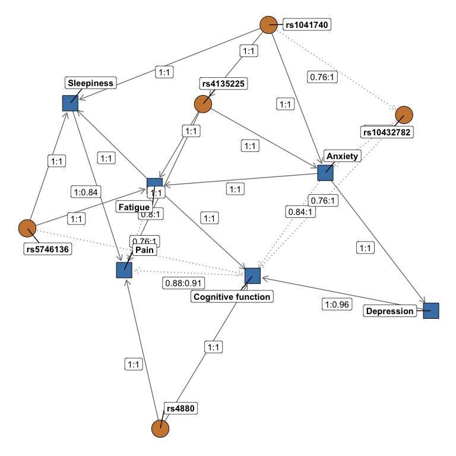

mvNUR Workflow 1: bnlearn
================
Lacey W. Heinsberg


# Copyright

Copyright 2023, University of Pittsburgh. All Rights Reserved.  
License: CC BY-SA 3.0
([link](https://creativecommons.org/licenses/by-sa/3.0/))

# Overview

This code was adapted from previous work led by Jerry Zhang, Lacey
Heinsberg, and Daniel Weeks:

Zhang JZ, Heinsberg LW, Krishnan M, Hawley NL, Major TJ, Carlson JC,
Harré Hindmarsh J, Watson H, Qasim M, Stamp LK, Dalbeth N, Murphy R, Sun
G, Cheng H, Naseri T, Reupena MS, Kershaw EE, Deka R, McGarvey ST,
Minster RL, Merriman TR, Weeks DE. Multivariate analysis of a missense
variant in CREBRF reveals associations with measures of adiposity in
people of Polynesian ancestries. Genet Epidemiol. 2023
Feb;47(1):105-118. doi: 10.1002/gepi.22508. Epub 2022 Nov 9. PMID:
36352773; PMCID: PMC9892232.

[GitHub Repository](https://github.com/lwheinsberg/mvCREBRF)

which was further adapted from:

“Multiple Quantitative Trait Analysis Using Bayesian Networks” by
Scutari, Howell, Balding, Mackay (Genetics, 2014).

[Link](http://www.bnlearn.com/research/genetics14/).

## bnlearn

The R package bnlearn is helpful for learning the graphical structure of
Bayesian networks, estimating their parameters, and performing some
useful inference. Installation instructions can be found in the README
file.

# Load Libraries

``` r
library(tidyverse)
library(lme4)
library(bnlearn)
library(parallel)
# The 'graph' package is a Bioconductor package.
library(graph)
#if (!require("BiocManager", quietly = TRUE))
#    install.packages("BiocManager")
#BiocManager::install("graph")
library(pander)
library(ggnetwork)
# The 'Rgraphviz' is a Bioconductor packaage.
library(Rgraphviz)
#if (!require("BiocManager", quietly = TRUE))
#    install.packages("BiocManager")
#BiocManager::install("Rgraphviz")
```

# Read in the synthetic dataset

As detailed in `00_mvNUR_DataPrep.Rmd`, the synthetic phenotype data
created for this example .Rmd were adjusted for age and sex, quantile
normalized, and outliers were removed. The quantile normalized adjusted
data set is read in below. Please see `README.Rmd` for more details
about the data set and variables.

``` r
# Read in the quantile normalized adjusted synthetic data set 
df_synth <- readRDS("data/SyntheticQuantNorm.rds") %>%
    mutate_at(
    .vars = vars(starts_with("rs")),
    .funs = list(~ case_when(
      . ==  "BB" ~ 2,
      . == "AB" ~ 1,
      . ==  "AA" ~ 0
    ))
  )

# The package to learn the Bayesian networks (bnlearn) does not support integer data,
# so convert integer columns to numeric
df_synth[sapply(df_synth, class) == "integer"] <- 
  sapply(df_synth[sapply(df_synth, class) == "integer"], as.numeric)
```

Store a list of phenotypes and variants of interest. See README.md for
information about phenotypes and SNPs of interest.

``` r
# Define the phenotypes of interest
traits <- c("EMO_tscore", "bdito", "FAT_tscore", "paohcif", "EPSscore", "pain")

# Define variants of interest 
genes <- c("rs4880", "rs5746136", "rs1041740", "rs10432782", "rs4135225", "rs7522705")
```

# Bayesian Network estimation

## Define functions

### fit.the.model

The Bayesian network model is constructed using the `fit.the.model()`
function, which employs a constrained learning algorithm based on
conditional independence testing, specifically the semi-interleaved
HITON-PC method. In this process, the algorithm identifies
“parent-child” relationships within the network, where nodes represent
either phenotypic traits or genetic variants, and edges signify
associations between these nodes. Notably, traits can have parent nodes
that are either genetic variants or other traits, but they can only
serve as parents to other traits, adhering to the constraint that
genetic variants do not act on traits (since genotypes are constant
across an individual’s lifespan).

To enforce this constraint, a “blacklist” is created using the
`tiers2blacklist()` function, preventing arcs from being directed
towards specific nodes. This restriction aims to guide the learning
process by ensuring that known causal relationships are inferred in the
correct direction from variants to traits, while also allowing for
customization to blacklist other traits if needed (e.g., you can
customize this to force/restrict a trait-\>trait relationship).

After the networks are learned, the nodes are categorized into subsets
for visualization, and the network structures are determined by
maximizing the Bayesian Information Criteria (BIC). This approach
facilitates the construction of Bayesian networks that capture
probabilistic relationships between traits and genetic variants, with
the learned structures reflecting potential causal associations.

Further details on the methodology can be found at
<http://www.bnlearn.com/research/genetics14/>.

``` r
# data: The data set to be used
# alpha: The significance level for conditional independence tests 

# Define model function to return a Bayesian network based 
# on a conditional correlation test and si.hiton.pc structure
# learning algorithm
fit.the.model <- function(data, alpha) { # Start fit.the.model
  
  # Creates an empty list (cpc) with a length equal to the length of the traits vector
  cpc <- vector(length(traits), mode = "list")
  # Assign names to the elements of the cpc list based on the values in the traits vector
  names(cpc) <- traits

  # Identify the parents of each trait (may be variants or other traits)
  for (t in seq_along(traits)) { # Start for 
   cpc[[t]] = learn.nbr(data[, c(traits, genes)], node = traits[t], debug = FALSE,
                   method = "si.hiton.pc", test = "cor", alpha = alpha)
  } # End for 

  # Merge the relevant variables to use for learning
  nodes <- unique(c(traits, unlist(cpc)))
  
  # Set up blacklist which specifies that variants cannot depend on traits
  blacklist <- tiers2blacklist(list(nodes[!(nodes %in% traits)], traits))
   
  # Build the Bayesian network
  bn <- hc(data[, nodes], blacklist = blacklist)

  # Return Bayesian network 
  return(bn)

} # End fit.the.model
```

### xval.the.model

The `xval.the.model()` function performs model training with n-fold
cross-validation (in the case of this example, 5-fold cross-validation).
During this process, the data set is divided into multiple partitions,
with each partition serving as the test set while the remaining data is
used for training. This process is repeated iteratively to ensure that
all data points are included in the test set at least once.

During each fold of cross-validation, the following steps are performed:

1)  Data Splitting: The dataset is divided into a training set
    (dtraining) and a test set (dtest).
2)  Model Fitting: A Bayesian network model is fitted to the training
    data using the `fit.the.model()` function. This model captures the
    probabilistic relationships between phenotypic traits and genetic
    variants.
3)  Prediction: The model is used to predict the values of phenotypic
    traits on the test set. These predictions are stored in the pred
    matrix.
4)  Posterior Estimation: Posterior estimates are computed for each
    trait based on the test data. These estimates are stored in the post
    matrix.
5)  Correlation Computation: The correlations between the predicted and
    observed values for each trait are calculated, both before (predcor)
    and after (postcor) cross-validation. These correlations provide a
    measure of the model’s predictive performance.
6)  Ridge Regression (Optional): If the ridge parameter is set to true,
    ridge regression is applied to certain nodes of the Bayesian network
    model to improve model performance.

Finally, the function returns various results, including the predicted
values, posterior estimates, observed values, and correlation
coefficients for each trait. Additionally, it provides the learned
models for each fold of cross-validation. This process allows for the
assessment of how well the Bayesian network model generalizes to unseen
data and provides insights into its predictive capabilities.

``` r
# data: The data set to be used 
# k: The number of folds for cross-validation
# cluster: The number of clusters to be used for parallel processing
# alpha: The significance level for conditional independence tests 
# ridge: A logical value indicating whether to use a custom threshold for network visualization

# Create a function to train the model with n fold cross validation, 
# 100-100/n% train and 100/n% test for 10 partitions
# Hold out each partition iteratively so that no data are totally held out
xval.the.model = function(data, k = 5, cluster, alpha, ridge) { # Start xval.the.model
  
  # Note: In cases of small sample sizes, k may need to be lowered

  # Store number of observations 
  n <- nrow(data)
  
  # Create a numeric vector named predcor initialized with a length
  # equal to the number of elements in the traits vector 
  # This vector will be used to store correlation values between
  # predicted and observed values for each trait
  predcor <- numeric(length(traits))
  names(predcor) <- traits
  
  # Repeat, creating a postcor vector that will be used to store 
  # correlation values for posterior estimates
  postcor <- numeric(length(traits))
  names(postcor) <- traits
  
  # Shuffle the data to get unbiased splits
  kcv <- split(sample(n), seq_len(k))
  # Store the length of each test set
  kcv.length <- sapply(kcv, length)

  # Train network models and support the optional use of ridge regression for model re-fitting under certain conditions
  predicted <- parLapply(kcv, cl = cluster, function(test) { # Start predicted
    
    # Create a matrix to store the predicted values
    pred <- matrix(0, nrow = length(test), ncol = length(traits))
    colnames(pred) <- traits
    # Create a matrix to store posterior estimates
    post = matrix(0, nrow = length(test), ncol = length(traits))
    colnames(post) = traits

    # Print a message for each cross-validation fold
    cat("* beginning cross-validation fold.\n")

    # Split training and test data
    dtraining <- data[-test, ]
    dtest <- data[test, ]
    
    # Fit the model on the training data (using function created in chunk above)
    model <- fit.the.model(dtraining, alpha = alpha)
    fitted <- bn.fit(model, dtraining[, nodes(model)])
    # Optional re-fit with ridge regression
    if (ridge) { # Start if
      
      # Load penalized library
      library(penalized)

      # Run ridge 
      for (no in nodes(fitted)) { # Start for
        
        node.parents <- parents(fitted, no)

        if (length(node.parents) < 3)
           next

        opt.lambda <- optL2(response = dtraining[, no],
                            penalized = dtraining[, node.parents],
                            model = "linear", trace = FALSE,
                            minlambda2 = 10e-5, maxlambda = 500)$lambda
        fitted[[no]] <- penalized(response = dtraining[, no],
                            penalized = dtraining[, node.parents],
                            model = "linear", trace = FALSE,
                            lambda1 = 0, lambda2 = opt.lambda)

      } # End for
      
    } # End if -> then 
    
    # Subset the test data
    dtest <- dtest[, nodes(model)]

    # Print message reporting the number of nodes in the Bayesian network model
    cat("  > model has", length(nodes(model)), "nodes.\n")

    # Predict each trait in turn, given all the parents
    # For each trait, use the fitted Bayesian network model (fitted) to make 
    # predictions (predict) based on the test data (dtest) for the nodes
    # in the model
    # The predictions are stored in the pred matrix, where each column corresponds to a trait
    for (t in traits)
      pred[, t] <- predict(fitted, node = t, data = dtest[, nodes(model)])

    # Iterate over the rows of the test data (dtest)
    # For each row, calculate the posterior estimates for all traits (traits) 
    # in the Bayesian network
    # Note that this uses the cpdist function to estimate the conditional
    # probability distribution of each trait given the evidence (values 
    # of other variables) from the test data
    # The resulting posterior estimates are stored in the post matrix, 
    # with each column representing a trait
    for (i in seq(nrow(dtest)))
      post[i, traits] = colMeans(cpdist(fitted, nodes = traits,
                           evidence = as.list(dtest[i, names(dtest) %in% genes]),
                           method = "lw", n = 1000))

      # Return a list with the pred and post results
      return(list(model = fitted, pred = pred, post = post))

    }) # End predicted
  

    # Summarize results from cross-validation and calculate and print statistics 
    # on the model's performance 
    posterior <- do.call(rbind, lapply(predicted, `[[`, "post"))
    causal <- do.call(rbind, lapply(predicted, `[[`, "pred"))
    cat("* overall cross-validated correlations:\n")
   
    # Iterate over each trait in the traits vector to calculate 
    # and print performance statistics for each trait separately
    for (t in traits) {
      predcor[t] = cor(causal[, t], data[unlist(kcv), t])
      cat("  > PREDCOR(", t, "):", predcor[t], "\n")
      postcor[t] = cor(posterior[, t], data[unlist(kcv), t])
      cat("  > POSTCOR(", t, "):", postcor[t], "\n")
    } # End for

    # Construct and return a list that summarizes various aspects of the 
    # cross-validation results and model performance
    return(list(predicted = causal, posterior = posterior,
    observed = data[unlist(kcv), t], predcor = predcor, postcor = postcor,
    models = lapply(predicted, `[[`, "model")))
   
} # End xval.the.model
```

### run_plot_graph

This code defines an R function called run_plot_graph that, calling the
functions above, learns and visualizes the Bayesian networks in the
data, including customizing node labels and appearance, and then returns
results related to the network analysis. Note that the following
function uses parallel computing which involves breaking down a complex
task into smaller subtasks that can be executed simultaneously, or in
parallel, by multiple processors or computers to speed up
computationally intense calculations.

``` r
# data: The dataset to be used for plotting the networks
# k: The number of folds for cross-validation
# alpha: The significance level for conditional independence tests
# use.custom.threshold: A logical value indicating whether to use a custom threshold for network visualization
# custom.threshold: The custom threshold value to be used if use.custom.threshold is set to TRUE
# ncluster: The number of clusters for parallel computation
# ...: Additional arguments to be passed to other functions

# Define function to plot the networks
run_plot_graph <- function(data = df_synth,
                            k = 10,
                            alpha = 0.01,
                            use.custom.threshold = FALSE,
                            custom.threshold = 0.90,
                            ncluster = 8,
                            ...) { # Start run_plot_graph
  
  #### CLUSTER
  # Create a cluster (cl) for parallel computation 
  cl <- makeCluster(ncluster)
  
  # Load library(bnlearn) and library(lme4) in the cluster 
  invisible(clusterEvalQ(cl, library(bnlearn)))
  invisible(clusterEvalQ(cl, library(lme4)))
  
  # Export the traits, genes, and fit.the.model objects to the cluster 
  # to make them available in the parallel environment
  clusterExport(cl = cl, c("traits", "genes", "fit.the.model"))
  
  # Initialize the pr001 variable as a vector of length k with the mode set to "list"
  pr001 <- vector(k, mode = "list")
  
  # Perform cross-validation (xval.the.model) k times and store the results in the pr001 list
  for (i in seq_along(pr001)) { # Start for 
    pr001[[i]] <- xval.the.model(data, 
                                 cluster = cl, 
                                 alpha = alpha, 
                                 ridge = FALSE,
                                 k = k) 
  } # End for 
  
  # Stop the cluster
  stopCluster(cl)
  #### CLUSTER
  
  # Calculate the average prediction correlation (pred.summary) and average 
  # posterior correlation (post.summary) based on cross-validation results
  pred.summary <- sapply(pr001, `[[`, "predcor")
  print(rowMeans(pred.summary))
  post.summary <- sapply(pr001, `[[`, "postcor")
  print(rowMeans(post.summary))
  
  # Average the network structures
  # Initialize a list (arclist) to store the network structures
  arclist <- list()
  # Extract the models from pr001 and append their arcs to the arclist
  for (i in seq_along(pr001)) { # Start for
    # Extract the models
    run <- pr001[[i]]$models
    for (j in seq_along(run))
      arclist[[length(arclist) + 1]] = arcs(run[[j]])
  } # End for
  # Compute the arc strengths
  # The nodes (genes and traits) present in the network structures are 
  # identified and stored in the nodes variable
  nodes <- unique(unlist(arclist))
  
  # Blacklist
  # Note: default boot.strength() or custom.strength() runs with 
  # "cpdag = TRUE" which means reversible arcs can have positive 
  # strength in both directions (so blacklist won't work as we expect)
  # Use "cpdag = FALSE" to truly make the blacklist work as expected 
  strength <- custom.strength(arclist, nodes = nodes, cpdag = FALSE)
  # Estimate the threshold and average the networks
  averaged <- averaged.network(strength)
  
  # Select relevant nodes (those with a degree greater than 0) 
  # and store in relevant.nodes
  relevant.nodes <- nodes(averaged)[sapply(nodes, degree, object = averaged) > 0]
  # Create a subgraph (averaged2) based on the relevant nodes
  averaged2 <- subgraph(averaged, relevant.nodes)
  # Extract the arc strengths (strength2) between relevant nodes 
  strength2 <- strength[(strength$from %in% relevant.nodes) & (strength$to %in% relevant.nodes), ]
  
  # Print information about the threshold value and minimum strength greater than the threshold 
  cat("threshold: ", attr(strength2, "threshold"), "\n")
  
  # Customize node labels 
  # Store the current node names from averaged
  current_nodes <- nodes(averaged)
  # Create a custom labels dictionary with all nodes from averaged2
  custom_labels <- setNames(current_nodes, current_nodes)
  # Replace the labels with more informative information 
  custom_labels["EMO_tscore"] <- "Anxiety"
  custom_labels["bdito"] <- "Depression"
  custom_labels["FAT_tscore"] <- "Fatigue"
  custom_labels["paohcif"] <- "Cognitive function"
  custom_labels["EPSscore"] <- "Sleepiness"
  custom_labels["pain"] <- "Pain"
  # Relabel nodes in averaged2 using the custom labels
  nodes(averaged2) <- custom_labels[nodes(averaged2)] 
  
  # Update the 'from' and 'to' columns in the strength object with the custom labels
  strength2$from <- custom_labels[strength2$from]
  strength2$to <- custom_labels[strength2$to]
  
  # Update the attribute names in the strength2 object
  attr(strength2, "nodes") <- custom_labels[attr(strength2, "nodes")] 
  
  # Need to also updated results$averaged and results$traits
  nodes(averaged) <- custom_labels[nodes(averaged)]
  traits <- custom_labels[traits]
  
  # strength2 retains nodes that are not in relevant.nodes as attributes 
  # Since the plotting code below uses the attributes of strength2 and averaged2,
  # we need to update the attributes to reflect only relevant nodes
  # Extract unique nodes from both "from" and "to" columns
  nodes_from_strength <- unique(c(strength$from, strength$to))
  nodes_from_strength2 <- unique(c(strength2$from, strength2$to))
  # Create a list of nodes to keep (nodes that appear in either data frame)
  nodes_to_keep <- intersect(nodes_from_strength, nodes_from_strength2)
  # Update the attributes of both data frames to only include nodes_to_keep
  attr(strength2, "nodes") <- attr(strength2, "nodes")[nodes_to_keep]

  # Print the minimum strength observed that is > threshold
  t <- attr(strength2, "threshold")
  v <- strength2$strength
  cat("min strength > threshold: ", min(v[v > t]), "\n")
  cat("strength: ", sort(strength2$strength))
  
  # Plot the network 
  # The appearance of nodes and edges is customized based on the data
  if (use.custom.threshold) {
    cat("Using custom threshold of ", custom.threshold, "\n")
    gR = strength.plot(
      averaged2, 
      strength2, 
      shape = "rectangle",
      layout = "fdp",
      render = F,
      threshold = custom.threshold
    )
  } else {
    gR = strength.plot(
      averaged2,
      strength2,
      shape = "rectangle",
      layout = "fdp",
      render = F
    )
  }
  
  # Customize plot
  nodeRenderInfo(gR)$fill = "lightblue"
  nodeRenderInfo(gR)$col = "darkblue"
  nodeRenderInfo(gR)$fill[traits] = "limegreen"
  nodeRenderInfo(gR)$col[traits] = "darkgreen"
  a <- arcs(bnlearn::subgraph(averaged, traits))
  a <- as.character(interaction(a[, "from"], a[, "to"], sep = "~"))
  edgeRenderInfo(gR)$col = "grey"
  edgeRenderInfo(gR)$col[a] = "darkgreen"
  
  # Render plot (gR) using Rgraphviz::renderGraph
  renderGraph(gR)
  
  # Create a list named results that contains the averaged2 network, 
  # strength2, averaged network, traits variables, and threshold value
  results <-
    list(
      averaged2 = averaged2,
      strength2 = strength2,
      averaged = averaged,
      traits = traits,
      threshold = t
    )
  
  # Return results
  return(results)
  
} # End run_plot_graph
```

### match.arcs.and.directions

This code defines an R function called match.arcs.and.directions which
is designed to match arcs in a network with their corresponding
direction coefficients in a strengths data frame, providing flexibility
to either keep or discard additional information based on the keep
argument.

``` r
# arcs: Arcs within a Bayesian network representing relationships 
# between nodes (genes or traits)
# nodes: Nodes within a Bayesian network, which can represent 
# either genes or traits
# strengths: Strength coefficients associated with the arcs in 
# the Bayesian network, indicating the strength and direction
# of relationships
# keep: A logical value indicating whether to keep additional
# information when matching arcs and directions in the 
# Bayesian network

# Define function to match arcs and directions 
match.arcs.and.directions <- function (arcs, 
                                       nodes,
                                       strengths, 
                                       keep = FALSE) { # Start match.arcs.and.directions
  if (nrow(strengths) < nrow(arcs))
    stop("insufficient number of strength coefficients.")
  a_hash <- interaction(arcs[, "from"], arcs[, "to"])
  s_hash <- interaction(strengths[, "from"], strengths[, "to"])
  if (keep) {
    s <- strengths[match(a_hash, s_hash), , drop = FALSE]
    coef = s$direction
  } else {
    s <- strengths[match(a_hash, s_hash), "direction"]
    from <- strengths[match(a_hash, s_hash), "from"]
    to <- strengths[match(a_hash, s_hash), "to"]
    names(s) <- paste0(from, "~", to)
    coef <- s
  }
  if (any(is.na(coef))) {
    missing = apply(arcs[is.na(coef), , drop = FALSE], 1,
                      function(x) {
                        paste(" (", x[1], ", ", x[2], ")", sep = "")
                      })
    stop(
      "the following arcs do not have a corresponding direction coefficients:",
      missing,
      "."
    )
  }
  
  # Return 
  return(s)
} # End match.arcs.and.directions
```

### redraw.graph.labels

Define redraw.graph.labels function, which enhances the graph created
above by adding labels to its edges. These labels make the graph more
informative by conveying information about the strength and direction of
relationships represented by each edge in the graph.

Strength: a measure of confidence of that edge while fixing the rest of
the network structure and is defined as the empirical frequency a
specific edge is observed over a set of networks learned from
bootstrapped samples (i.e., the number of times the edge was present out
of the total number of bootstrapped realizations).

Direction: the probability of the edge’s direction conditional on the
edge’s presence within the network (i.e., the number of times the edge
traveled in a specific direction out of the total number of bootstrapped
realizations in which it was present).

``` r
# averaged2: Bayesian network learned through functions above (relevant nodes only)
# strength2: Bayesian network strengths learned through the functions above
# averaged: Bayesian network learned through functions above (all nodes)
# traits: Phenotypes of interest
# custom.threshold: Custom threshold to customize line thickness/type

# Define function to redraw graph labels 
redraw.graph.labels <-
  function(averaged2,
           strength2,
           averaged,
           traits,
           custom.threshold) { # Start redraw.graph.labels
    gR <- strength.plot(
      averaged2,
      strength2,
      shape = "rectangle",
      layout = "fdp",
      render = F,
      threshold = custom.threshold
    )
    x <- averaged2
    str <-
      match.arcs.and.directions(
        arcs = x$arcs,
        nodes = names(x$nodes),
        strengths = strength2
    )
    str2 <- bnlearn:::match.arcs.and.strengths(
      arcs = x$arcs,
      nodes = names(x$nodes),
      strengths = strength2
    )

    # Customize edge labels 
    labels2 <- paste0(round(str2, 2), ":", round(str, 2))
    names(labels2) <- names(str)
    
    # Begin plot
    gR <- Rgraphviz::layoutGraph(gR,
                             edgeAttrs = list(label = labels2),
                             layoutType = "fdp")
    
    # Customize plot
    nodeRenderInfo(gR)$fill["rs4880"] = "grey"
    nodeRenderInfo(gR)$fill["rs5746136"] = "grey"
    nodeRenderInfo(gR)$fill["rs1041740"] = "grey"
    nodeRenderInfo(gR)$fill["rs10432782"] = "grey"
    nodeRenderInfo(gR)$fill["rs4135225"] = "grey"
    nodeRenderInfo(gR)$fill["rs7522705"] = "grey"
    nodeRenderInfo(gR)$fill = "lightblue"
    nodeRenderInfo(gR)$col = "darkblue"
    nodeRenderInfo(gR)$fill[traits] = "limegreen"
    nodeRenderInfo(gR)$col[traits] = "darkgreen"
    a = arcs(bnlearn::subgraph(averaged2, traits))
    a = as.character(interaction(a[, "from"], a[, "to"], sep = "~"))
    edgeRenderInfo(gR)$col = "grey"
    edgeRenderInfo(gR)$col[a] = "darkgreen"
    Rgraphviz::renderGraph(gR)
} # End redraw.graph.labels
```

### redraw.label.ggnet

The following function is used for an additional redrawing of the
Bayesian network but in a ggnetwork/ggplot2 framework, enhancing it with
labels and color-coding for interpretation in the context of Bayesian
analysis. Of note, this function calls in ggrepel() so that node and
edge labels do not overlap, further supporting the user in creating
publication quality figures.

``` r
# averaged2: Bayesian network learned through functions above (relevant nodes only)
# strength2: Bayesian network strengths learned through the functions above
# averaged: Bayesian network learned through functions above (all nodes)
# traits: Phenotype of interest
# ...: Additional arguments to be passed to other functions

# Define function to redraw the graph in ggnetwork/ggplot2 framework
redraw.label.ggnet <- function(averaged2, 
                               strength2,
                               averaged,
                               traits,
                               ...) { # Start redraw.label.ggnet
  
  
  x <- averaged2
  
  # Relies on bnlearn code to return a directed graph
  # Get the directions and strengths
  vec_dir <- match.arcs.and.directions(
    arcs = x$arcs,
    nodes = names(x$nodes),
    strengths = strength2
  )
  vec_str <- bnlearn:::match.arcs.and.strengths(
    arcs = x$arcs,
    nodes = names(x$nodes),
    strengths = strength2
  )
    
  # Create data.frame with node/directions/strengths
  # Join this to the data.frame created by ggnetwork
  df_dir_str <- data.frame(do.call(rbind, str_split(names(vec_dir), "~")),
                            vec_dir,
                            vec_str,
                            stringsAsFactors = F)
  names(df_dir_str)
    
  # Convert NEL graph to iGraph to ggnetwork data.frame
  # This step 'shuffles' the edge orders so vec_dir and vec_str are not in same order
  # as df_ggnetwork
  graph_igraph <- igraph::igraph.from.graphNEL(as.graphNEL(averaged2))
  df_ggnetwork <- ggnetwork(graph_igraph, ...)
  df_ggnetwork$vertex.names <- as.character(df_ggnetwork$name)
  df_ggnetwork$xend <- as.numeric(df_ggnetwork$xend)
  df_ggnetwork$yend <- as.numeric(df_ggnetwork$yend)
  df_ggnetwork$x <- as.numeric(df_ggnetwork$x)
  df_ggnetwork$y <- as.numeric(df_ggnetwork$y)
    
  # Create a data.frame of node coordinates as this is needed to determine the
  # destination node/end vertex
  df_node_coord <- df_ggnetwork %>% 
    filter(is.na(weight)) %>% 
    select(vertex.names, x, y) %>%
    transmute(vertex.names.end = vertex.names, xend = x, yend = y)
  
  # Join back to form end vertex
  # This step relies on fuzzyjoin with L2 norm < 0.05 since ggnetwork shifts the node 
  # positions around randomly
  df_ggnetwork <- df_ggnetwork %>%
      fuzzyjoin::distance_left_join(df_node_coord,
                                    by = c("xend", "yend"),
                                    max_dist = 0.05)
    
  # Join the direction/probability table based on source node and end node
  df_ggnetwork <- df_ggnetwork %>% left_join(df_dir_str,
                                    by = c("vertex.names" = "X1", "vertex.names.end" = "X2"))
    
  # Create a node type lookup table for node coloring
  # Note this will need to be manually edited if readapting this code
  df_vertex_table = data.frame(
    vertex.names = c(
      "Anxiety",
      "Depression",
      "Fatigue",
      "Cognitive function",
      "Sleepiness",
      "Pain",
      "rs4880",
      "rs5746136",
      "rs1041740",
      "rs10432782",
      "rs4135225",
      "rs7522705"
    ),
    type = c(
      "Symptom",
      "Symptom",
      "Symptom",
      "Symptom",
      "Symptom",
      "Symptom",
      "Genotype",
      "Genotype",
      "Genotype",
      "Genotype",
      "Genotype",
      "Genotype"), stringsAsFactors = F)
    
  # Join node type table
  df_ggnetwork <- df_ggnetwork %>% left_join(df_vertex_table, by = "vertex.names")
    
  # Create a column for node colors based on the node type
  # Note that in this example, we only have two node types (symptom/SNP)
  df_ggnetwork <- df_ggnetwork %>%
      mutate(node_color = ifelse(grepl("^rs", vertex.names), "tan3", "steelblue"))

  # Fix the data.frame column names, fuzzyjoin appended .x and .y to column names
  names(df_ggnetwork)[names(df_ggnetwork) == "xend.x"] <- "xend"
  names(df_ggnetwork)[names(df_ggnetwork) == "yend.x"] <- "yend"

  # Plot with ggplot and ggnetwork geoms
  ggplot(df_ggnetwork, aes(
    x = x,
    y = y,
    xend = xend,
    yend = yend)) +
    geom_edges(aes(linetype = (vec_str > 0.9)),
               color = "grey50",
                 arrow = arrow(length = unit(8, "pt"), type = "open")) +
    geom_nodes(size = 10,
         aes(shape = type, color = node_color, fill = node_color),
         stroke = 0.5,   # Set the size of the border
         color = "black") +  # Set the color of the border
    geom_edgelabel_repel(aes(label = paste0(
      round(vec_str, 2), ":", round(vec_dir, 2)))) +
    geom_nodelabel_repel(
      aes(label = vertex.names),
      force = 1,
      fontface = "bold",
      box.padding = unit(1.2, "lines"),
      color = "black") +
    scale_color_manual(values = c("tan3" = "tan3", "steelblue" = "steelblue")) +
    scale_fill_manual(values = c("tan3" = "tan3", "steelblue" = "steelblue")) +
    scale_linetype_manual(
      "Node Signif.",
      values = c("FALSE" = "dotted", "TRUE" = "solid"),
      label = c("<= 90 Strength", "> 0.90 Strength")) +
      scale_shape_manual(values = c(21:23)) + theme_blank(legend.position = "none")

} # End redraw.label.ggnet
```

# Apply functions and visualize results

## Data summaries

``` r
# Check dimensions of the synthetic data used here 
dim(df_synth)
```

    ## [1] 763  12

``` r
# Summary of data
summary(df_synth)
```

    ##      rs4880         rs5746136        rs1041740        rs10432782    
    ##  Min.   :0.0000   Min.   :0.0000   Min.   :0.0000   Min.   :0.0000  
    ##  1st Qu.:0.0000   1st Qu.:0.0000   1st Qu.:0.0000   1st Qu.:0.0000  
    ##  Median :1.0000   Median :0.0000   Median :0.0000   Median :0.0000  
    ##  Mean   :0.9725   Mean   :0.4404   Mean   :0.4312   Mean   :0.3028  
    ##  3rd Qu.:1.0000   3rd Qu.:1.0000   3rd Qu.:1.0000   3rd Qu.:1.0000  
    ##  Max.   :2.0000   Max.   :2.0000   Max.   :2.0000   Max.   :2.0000  
    ##    rs4135225        rs7522705        EMO_tscore            bdito          
    ##  Min.   :0.0000   Min.   :0.0000   Min.   :-8.598853   Min.   :-8.142873  
    ##  1st Qu.:0.0000   1st Qu.:0.0000   1st Qu.:-4.745668   1st Qu.:-4.745668  
    ##  Median :1.0000   Median :1.0000   Median :-1.117270   Median :-1.117270  
    ##  Mean   :0.6606   Mean   :0.7339   Mean   :-0.000116   Mean   : 0.001758  
    ##  3rd Qu.:1.0000   3rd Qu.:1.0000   3rd Qu.: 3.607629   3rd Qu.: 3.607629  
    ##  Max.   :2.0000   Max.   :2.0000   Max.   :16.803582   Max.   :17.664804  
    ##    FAT_tscore           paohcif             EPSscore        
    ##  Min.   :-8.598853   Min.   :-8.598853   Min.   :-8.598853  
    ##  1st Qu.:-4.802835   1st Qu.:-4.802835   1st Qu.:-4.876630  
    ##  Median :-1.117270   Median :-1.117270   Median :-0.885189  
    ##  Mean   :-0.000098   Mean   :-0.001958   Mean   : 0.000935  
    ##  3rd Qu.: 3.607629   3rd Qu.: 3.607629   3rd Qu.: 3.607629  
    ##  Max.   :17.664804   Max.   :17.664804   Max.   :17.664804  
    ##       pain          
    ##  Min.   :-8.370863  
    ##  1st Qu.:-4.802835  
    ##  Median :-1.278710  
    ##  Mean   :-0.003648  
    ##  3rd Qu.: 3.468126  
    ##  Max.   :17.664804

``` r
# Correlation structure of data
cor(df_synth[,traits])
```

    ##            EMO_tscore     bdito FAT_tscore   paohcif  EPSscore      pain
    ## EMO_tscore  1.0000000 0.5990665  0.6372831 0.5440664 0.1828286 0.2252510
    ## bdito       0.5990665 1.0000000  0.4163014 0.5059705 0.1838254 0.2103236
    ## FAT_tscore  0.6372831 0.4163014  1.0000000 0.5600751 0.3750783 0.3998224
    ## paohcif     0.5440664 0.5059705  0.5600751 1.0000000 0.1374550 0.2780501
    ## EPSscore    0.1828286 0.1838254  0.3750783 0.1374550 1.0000000 0.4317377
    ## pain        0.2252510 0.2103236  0.3998224 0.2780501 0.4317377 1.0000000

``` r
# View list of traits/SNPs of interest
traits
```

    ## [1] "EMO_tscore" "bdito"      "FAT_tscore" "paohcif"    "EPSscore"  
    ## [6] "pain"

``` r
genes
```

    ## [1] "rs4880"     "rs5746136"  "rs1041740"  "rs10432782" "rs4135225" 
    ## [6] "rs7522705"

## Visualize learned networks as graphs

### Regular graph

Plot the base graph showing only the directions of association but not
the strengths.

``` r
set.seed(6)
results <- run_plot_graph(data = df_synth, k = 5, alpha = 0.1, ncluster = 8) 
```

    ## Warning in split.default(sample(n), seq_len(k)): data length is not a multiple
    ## of split variable

    ## * overall cross-validated correlations:
    ##   > PREDCOR( EMO_tscore ): 0.3450264 
    ##   > POSTCOR( EMO_tscore ): 0.3414097 
    ##   > PREDCOR( bdito ): 0.5794972 
    ##   > POSTCOR( bdito ): 0.1493995 
    ##   > PREDCOR( FAT_tscore ): 0.7323366 
    ##   > POSTCOR( FAT_tscore ): 0.4692394 
    ##   > PREDCOR( paohcif ): 0.6703178 
    ##   > POSTCOR( paohcif ): 0.3069046 
    ##   > PREDCOR( EPSscore ): 0.4307685 
    ##   > POSTCOR( EPSscore ): 0.2816233 
    ##   > PREDCOR( pain ): 0.5086095 
    ##   > POSTCOR( pain ): 0.341023

    ## Warning in split.default(sample(n), seq_len(k)): data length is not a multiple
    ## of split variable

    ## * overall cross-validated correlations:
    ##   > PREDCOR( EMO_tscore ): 0.3668206 
    ##   > POSTCOR( EMO_tscore ): 0.3700903 
    ##   > PREDCOR( bdito ): 0.5824107 
    ##   > POSTCOR( bdito ): 0.1717829 
    ##   > PREDCOR( FAT_tscore ): 0.7340804 
    ##   > POSTCOR( FAT_tscore ): 0.477849 
    ##   > PREDCOR( paohcif ): 0.6728188 
    ##   > POSTCOR( paohcif ): 0.3164136 
    ##   > PREDCOR( EPSscore ): 0.4332637 
    ##   > POSTCOR( EPSscore ): 0.2837643 
    ##   > PREDCOR( pain ): 0.516585 
    ##   > POSTCOR( pain ): 0.3405448

    ## Warning in split.default(sample(n), seq_len(k)): data length is not a multiple
    ## of split variable

    ## * overall cross-validated correlations:
    ##   > PREDCOR( EMO_tscore ): 0.3362601 
    ##   > POSTCOR( EMO_tscore ): 0.3379467 
    ##   > PREDCOR( bdito ): 0.6035443 
    ##   > POSTCOR( bdito ): 0.1817662 
    ##   > PREDCOR( FAT_tscore ): 0.7327031 
    ##   > POSTCOR( FAT_tscore ): 0.4683404 
    ##   > PREDCOR( paohcif ): 0.6564999 
    ##   > POSTCOR( paohcif ): 0.3133521 
    ##   > PREDCOR( EPSscore ): 0.4288491 
    ##   > POSTCOR( EPSscore ): 0.2880677 
    ##   > PREDCOR( pain ): 0.5386219 
    ##   > POSTCOR( pain ): 0.3436355

    ## Warning in split.default(sample(n), seq_len(k)): data length is not a multiple
    ## of split variable

    ## * overall cross-validated correlations:
    ##   > PREDCOR( EMO_tscore ): 0.3339423 
    ##   > POSTCOR( EMO_tscore ): 0.3338617 
    ##   > PREDCOR( bdito ): 0.5858688 
    ##   > POSTCOR( bdito ): 0.1620462 
    ##   > PREDCOR( FAT_tscore ): 0.7323323 
    ##   > POSTCOR( FAT_tscore ): 0.4717575 
    ##   > PREDCOR( paohcif ): 0.674619 
    ##   > POSTCOR( paohcif ): 0.3244228 
    ##   > PREDCOR( EPSscore ): 0.4576816 
    ##   > POSTCOR( EPSscore ): 0.2920725 
    ##   > PREDCOR( pain ): 0.5089625 
    ##   > POSTCOR( pain ): 0.3574538

    ## Warning in split.default(sample(n), seq_len(k)): data length is not a multiple
    ## of split variable

    ## * overall cross-validated correlations:
    ##   > PREDCOR( EMO_tscore ): 0.3341934 
    ##   > POSTCOR( EMO_tscore ): 0.3342815 
    ##   > PREDCOR( bdito ): 0.590734 
    ##   > POSTCOR( bdito ): 0.1302828 
    ##   > PREDCOR( FAT_tscore ): 0.7350113 
    ##   > POSTCOR( FAT_tscore ): 0.4735605 
    ##   > PREDCOR( paohcif ): 0.670765 
    ##   > POSTCOR( paohcif ): 0.3125848 
    ##   > PREDCOR( EPSscore ): 0.4389516 
    ##   > POSTCOR( EPSscore ): 0.2794547 
    ##   > PREDCOR( pain ): 0.5230457 
    ##   > POSTCOR( pain ): 0.3356012 
    ## EMO_tscore      bdito FAT_tscore    paohcif   EPSscore       pain 
    ##  0.3432486  0.5884110  0.7332928  0.6690041  0.4379029  0.5191649 
    ## EMO_tscore      bdito FAT_tscore    paohcif   EPSscore       pain 
    ##  0.3435180  0.1590555  0.4721494  0.3147356  0.2849965  0.3436517 
    ## threshold:  0.6 
    ## min strength > threshold:  0.76 
    ## strength:  0 0 0 0 0 0 0 0 0 0 0 0 0 0 0 0 0 0 0 0 0 0 0 0 0 0 0 0 0 0 0 0 0 0 0 0 0 0 0 0 0.04 0.04 0.08 0.08 0.08 0.08 0.12 0.12 0.12 0.12 0.12 0.12 0.16 0.16 0.2 0.2 0.32 0.32 0.36 0.36 0.4 0.4 0.6 0.6 0.76 0.76 0.76 0.76 0.76 0.76 0.76 0.76 0.8 0.8 0.84 0.84 0.88 0.88 1 1 1 1 1 1 1 1 1 1 1 1 1 1 1 1 1 1 1 1 1 1 1 1 1 1 1 1 1 1 1 1

<!-- -->

### Labeled high-strength graph

Redraw graph adding strengths/directions to association lines.

The strength and directionalities of the edges of the Bayesian networks
are inferred through a bootstrapped process so resulting networks vary a
bit from run to run. As such, representative networks (i.e., averaged)
are plotted.

The code below calls in the function created above to add specific
details on the strength (Es) and direction (Ed) of each edge that
summarize the results across the total number of bootstrapped
realizations.

Edge strength is a measure of confidence of that edge while fixing the
rest of the network structure and is defined as the empirical frequency
a specific edge is observed over a set of networks learned from
bootstrapped samples (i.e., the number of times the edge was present out
of the total number of bootstrapped realizations).

Edge direction represents the probability of the edge’s direction
conditional on the edge’s presence within the network (i.e., the number
of times the edge traveled in a specific direction out of the total
number of bootstrapped realizations in which it was present).

An edge is included in the network graph if its strength is larger than
a significance threshold learned from the bootstrapped samples.

``` r
# Redraw graph adding strengths/directions to association lines using function created above 
# Here, we use a threshold of 0.9 to indicate "strong" associations
# In this case, edges with a strength >0.9 will be solid, while edges with a strength <0.9 will be dashed
set.seed(6)
redraw.graph.labels(
  results$averaged2,
  results$strength2,
  results$averaged,
  results$traits,
  custom.threshold = 0.90
)
```

<!-- -->

Here we can visualize the strengths and directions as a table.

``` r
# Visualize strengths/directions as a table 
results$strength2 %>%
 filter(strength > 0 & direction > 0 & strength > results$threshold) %>%
  arrange(strength) %>% pander()
```

|        from        |         to         | strength | direction |
|:------------------:|:------------------:|:--------:|:---------:|
|     rs1041740      |     rs10432782     |   0.76   |     1     |
|     rs5746136      | Cognitive function |   0.76   |     1     |
|     rs10432782     |      Anxiety       |   0.76   |     1     |
|     rs10432782     | Cognitive function |   0.76   |     1     |
|      Fatigue       |        Pain        |   0.8    |     1     |
|      Anxiety       | Cognitive function |   0.84   |     1     |
|        Pain        | Cognitive function |   0.88   |  0.09091  |
| Cognitive function |        Pain        |   0.88   |  0.9091   |
|      Anxiety       |     Depression     |    1     |     1     |
|      Anxiety       |      Fatigue       |    1     |     1     |
|     Depression     | Cognitive function |    1     |   0.96    |
|      Fatigue       |     Sleepiness     |    1     |     1     |
|      Fatigue       | Cognitive function |    1     |     1     |
|     Sleepiness     |        Pain        |    1     |   0.84    |
|        Pain        |     Sleepiness     |    1     |   0.16    |
|     rs1041740      |      Anxiety       |    1     |     1     |
|     rs1041740      |     Sleepiness     |    1     |     1     |
|     rs1041740      |     rs4135225      |    1     |     1     |
|     rs4135225      |      Anxiety       |    1     |     1     |
|     rs4135225      |      Fatigue       |    1     |     1     |
|     rs4135225      |        Pain        |    1     |     1     |
|       rs4880       |        Pain        |    1     |     1     |
|       rs4880       | Cognitive function |    1     |     1     |
|     rs5746136      |      Fatigue       |    1     |     1     |
|     rs5746136      |     Sleepiness     |    1     |     1     |
| Cognitive function |     Depression     |    1     |   0.04    |

### ggnetwork graph

Finally, we redraw the graph again. This time, we are changing the
colors, line types, and using ggrepel so that node and edge labels do
not overlap.

``` r
# Redraw graph in black and white using ggnetwork through the function created above 
set.seed(6)
redraw.label.ggnet(results$averaged2,
                   results$strength2,
                   results$averaged,
                   results$traits)
```

<!-- -->

Interpretation: Given the complexity of this plot, let’s focus on
breaking apart a few results for a single variant, rs5746136. In this
example figure, we see direct associations (solid arrows pointing away
from the variant) between the rs5746136 with sleepiness and fatigue, and
a weaker direct association (dashed line pointing away from the variant)
with cognitive function. We also observe an indirect association between
rs5746136 and cognitive function through fatigue which can be
interpreted as cognitive function being conditionally independent of
rs5746136 given the presence of fatigue.

In this figure, the strengths (Es) and directions (Ed) of the
relationships are also depicted along the edges (Es:Ed). As described
above, the strength is a measure of confidence of that edge while fixing
the rest of the network structure and is defined as the empirical
frequency a specific edge is observed over a set of networks learned
from bootstrapped samples (i.e., the number of times the edge was
present out of the total number of bootstrapped realizations). Edge
direction represents the probability of the edge’s direction conditional
on the edge’s presence within the network (i.e., the number of times the
edge traveled in a specific direction out of the total number of
bootstrapped realizations in which it was present). So in the example
figure, we see an association between rs5746136 and fatigue with Es:Ed
values of 1:1. This means that the edge was present in 100% of all
bootstrapped realizations and the relationship traveled from the
rs5746136 variant (“parent”) to fatigue (“child”) 100% of the time. Note
that in our “blacklist” code above, we specified that all variants could
only be a “parent” and not a “child” – so directions of 1 facing away
from variants to symptoms are expected. This is not the case with the
arrow traveling from cognitive function to pain. With Es:Ed values of
0.88:0.91, this relationship was observed in 88% of boostrapped
realizations but traveled in the shown direction in only 91% of
realizations. Finally, note that edges with a strength \>0.9 are solid,
while edges with a strength \<0.9 are dashed.

# Conclusion

And with that, we conclude our `bnlearn` tutorial! We hope that this
code is documented in enough detail so that you can easily adapt it for
your own projects, but feel free to reach out with any questions! -Lacey

# Session information

``` r
sessioninfo::session_info()
```

    ## ─ Session info ───────────────────────────────────────────────────────────────
    ##  setting  value
    ##  version  R version 4.2.1 (2022-06-23)
    ##  os       macOS Ventura 13.4
    ##  system   aarch64, darwin20
    ##  ui       X11
    ##  language (EN)
    ##  collate  en_US.UTF-8
    ##  ctype    en_US.UTF-8
    ##  tz       America/New_York
    ##  date     2023-10-31
    ##  pandoc   3.1.1 @ /Applications/RStudio.app/Contents/Resources/app/quarto/bin/tools/ (via rmarkdown)
    ## 
    ## ─ Packages ───────────────────────────────────────────────────────────────────
    ##  package      * version  date (UTC) lib source
    ##  BiocGenerics * 0.44.0   2022-11-07 [1] Bioconductor
    ##  bnlearn      * 4.8.3    2023-04-29 [1] CRAN (R 4.2.0)
    ##  boot           1.3-28.1 2022-11-22 [2] CRAN (R 4.2.0)
    ##  cli            3.6.1    2023-03-23 [1] CRAN (R 4.2.0)
    ##  colorspace     2.1-0    2023-01-23 [1] CRAN (R 4.2.0)
    ##  digest         0.6.31   2022-12-11 [1] CRAN (R 4.2.0)
    ##  dplyr        * 1.1.2    2023-04-20 [1] CRAN (R 4.2.0)
    ##  evaluate       0.20     2023-01-17 [1] CRAN (R 4.2.0)
    ##  fansi          1.0.4    2023-01-22 [1] CRAN (R 4.2.0)
    ##  farver         2.1.1    2022-07-06 [1] CRAN (R 4.2.0)
    ##  fastmap        1.1.1    2023-02-24 [1] CRAN (R 4.2.0)
    ##  forcats      * 1.0.0    2023-01-29 [1] CRAN (R 4.2.0)
    ##  fuzzyjoin      0.1.6    2020-05-15 [1] CRAN (R 4.2.0)
    ##  generics       0.1.3    2022-07-05 [1] CRAN (R 4.2.0)
    ##  ggnetwork    * 0.5.12   2023-03-06 [1] CRAN (R 4.2.0)
    ##  ggplot2      * 3.4.2    2023-04-03 [1] CRAN (R 4.2.0)
    ##  ggrepel        0.9.3    2023-02-03 [1] CRAN (R 4.2.0)
    ##  glue           1.6.2    2022-02-24 [1] CRAN (R 4.2.0)
    ##  graph        * 1.76.0   2022-11-07 [1] Bioconductor
    ##  gtable         0.3.3    2023-03-21 [1] CRAN (R 4.2.0)
    ##  highr          0.10     2022-12-22 [1] CRAN (R 4.2.0)
    ##  hms            1.1.3    2023-03-21 [1] CRAN (R 4.2.0)
    ##  htmltools      0.5.5    2023-03-23 [1] CRAN (R 4.2.0)
    ##  igraph         1.4.2    2023-04-07 [1] CRAN (R 4.2.0)
    ##  knitr        * 1.42     2023-01-25 [1] CRAN (R 4.2.1)
    ##  labeling       0.4.2    2020-10-20 [1] CRAN (R 4.2.0)
    ##  lattice        0.21-8   2023-04-05 [2] CRAN (R 4.2.0)
    ##  lifecycle      1.0.3    2022-10-07 [1] CRAN (R 4.2.0)
    ##  lme4         * 1.1-32   2023-03-14 [1] CRAN (R 4.2.0)
    ##  lubridate    * 1.9.2    2023-02-10 [1] CRAN (R 4.2.0)
    ##  magrittr       2.0.3    2022-03-30 [1] CRAN (R 4.2.0)
    ##  MASS           7.3-58.3 2023-03-07 [2] CRAN (R 4.2.0)
    ##  Matrix       * 1.5-4    2023-04-04 [1] CRAN (R 4.2.0)
    ##  minqa          1.2.5    2022-10-19 [1] CRAN (R 4.2.0)
    ##  munsell        0.5.0    2018-06-12 [1] CRAN (R 4.2.0)
    ##  nlme           3.1-162  2023-01-31 [2] CRAN (R 4.2.0)
    ##  nloptr         2.0.3    2022-05-26 [1] CRAN (R 4.2.0)
    ##  pander       * 0.6.5    2022-03-18 [1] CRAN (R 4.2.0)
    ##  pillar         1.9.0    2023-03-22 [1] CRAN (R 4.2.0)
    ##  pkgconfig      2.0.3    2019-09-22 [1] CRAN (R 4.2.0)
    ##  purrr        * 1.0.1    2023-01-10 [1] CRAN (R 4.2.0)
    ##  R6             2.5.1    2021-08-19 [1] CRAN (R 4.2.0)
    ##  Rcpp           1.0.10   2023-01-22 [1] CRAN (R 4.2.0)
    ##  readr        * 2.1.4    2023-02-10 [1] CRAN (R 4.2.0)
    ##  Rgraphviz    * 2.42.0   2022-11-07 [1] Bioconductor
    ##  rlang          1.1.0    2023-03-14 [1] CRAN (R 4.2.0)
    ##  rmarkdown      2.21     2023-03-26 [1] CRAN (R 4.2.0)
    ##  rstudioapi     0.14     2022-08-22 [1] CRAN (R 4.2.0)
    ##  scales         1.2.1    2022-08-20 [1] CRAN (R 4.2.0)
    ##  sessioninfo    1.2.2    2021-12-06 [1] CRAN (R 4.2.0)
    ##  stringi        1.7.12   2023-01-11 [1] CRAN (R 4.2.0)
    ##  stringr      * 1.5.0    2022-12-02 [1] CRAN (R 4.2.0)
    ##  tibble       * 3.2.1    2023-03-20 [1] CRAN (R 4.2.0)
    ##  tidyr        * 1.3.0    2023-01-24 [1] CRAN (R 4.2.0)
    ##  tidyselect     1.2.0    2022-10-10 [1] CRAN (R 4.2.0)
    ##  tidyverse    * 2.0.0    2023-02-22 [1] CRAN (R 4.2.0)
    ##  timechange     0.2.0    2023-01-11 [1] CRAN (R 4.2.0)
    ##  tzdb           0.3.0    2022-03-28 [1] CRAN (R 4.2.0)
    ##  utf8           1.2.3    2023-01-31 [1] CRAN (R 4.2.0)
    ##  vctrs          0.6.1    2023-03-22 [1] CRAN (R 4.2.0)
    ##  withr          2.5.0    2022-03-03 [1] CRAN (R 4.2.0)
    ##  xfun           0.38     2023-03-24 [1] CRAN (R 4.2.0)
    ##  yaml           2.3.7    2023-01-23 [1] CRAN (R 4.2.1)
    ## 
    ##  [1] /Users/law145/Library/R/arm64/4.2/library
    ##  [2] /Library/Frameworks/R.framework/Versions/4.2-arm64/Resources/library
    ## 
    ## ──────────────────────────────────────────────────────────────────────────────
